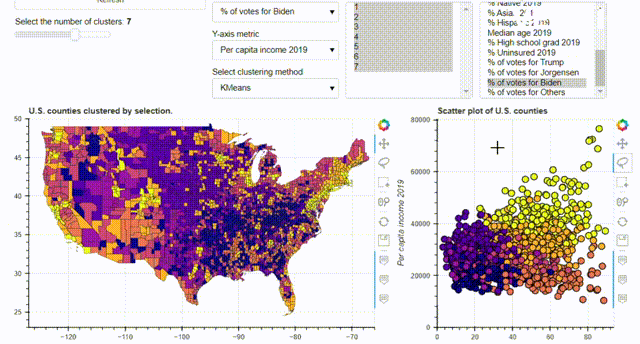

<h1 align="center">Hi 👋, I'm Rens Schipper</h1>
<h3 align="center">I'm an allround Data-professional</h3>

- 🌱 I’m currently learning **SKlearn, Geopandas, Japanese**

- 👨‍💻 All of my projects are available at [https://portfolio-website-e0j8.onrender.com/home#](https://portfolio-website-e0j8.onrender.com/home#)

- 📫 How to reach me **rens.schipper@live.nl**

- ⚡ Fun fact **I'm history, geography and language nerd.**

<h3 align="left">Connect with me:</h3>

<h3 align="left">Languages and Tools:</h3>

       

